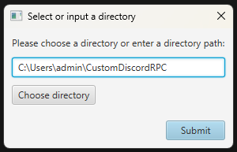
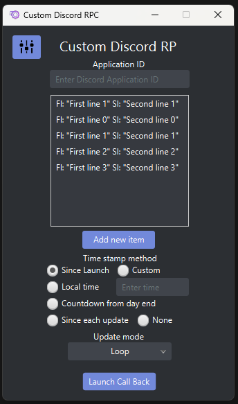
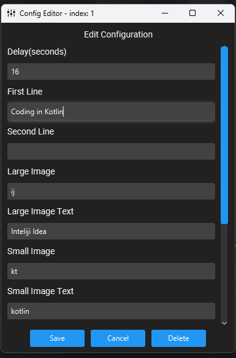

# CDiscrodRP

CDiscordRP is a simple program that allows you to display your current game in your Discord profile.
This program is written in Java 8 and kotlin 1.7.21 and uses the Discord IPC, JavaFX, and AnimatesFX libraries.

This is rather a project for me to learn how to use JavaFX and Kotlin, instead of a serious project.
although you might see some feature is useless and not needed, but its fun to write these.

I build this during my free time, so I can't guarantee that I will update this project frequently.

## Support
| Operating System | Auto Launch On Start up         | General Function | 
|------------------|---------------------------------|------------------|
| Windows          | Supported/(tested on 10 and 11) | Supported        |
| Macos            | Currently not supported         | Supported        |
| Linux            | Currently not supported         | Supported        |

## How to use


on your first start, you will be asked to select a directory where the program will store its data.
This directory will be used to store the config Json file
This data is stored in the environment variable "CDRPCDir"




Now after you selected a directory, you will see the main screen.
the Application ID field is the field where you will enter your application ID. on
Discord Developer Portal(https://discord.com/developers/applications), you can create a 
new application and copy the application ID from there.

Double-clicking an item on the list will open the edit screen, in this field you can edit the detail 
about the text you want to display.

You can start the callback by pressing the "Launch Callback" button.




Delay: the delay between each callback in milliseconds, this is ignored if you only have one item in the list.
Large image/Small Image: this can either be a image key on discord, or a direct link to an image.
First Line/Second Line: the text that will be displayed on the first line and second line in the rich presence.

Any field that is null or empty will be ignored

**ANY TEXT YOU ENTER HERE WILL BE DISPLAYED ON DISCORD, SO BE CAREFUL WHAT YOU ENTER, YOU MIGHT GET BANNED FOR INAPPROPRIATE STUFF**
**I AM NOT RESPONSIBLE FOR ANYTHING YOU DO WITH THIS PROGRAM**

There is a lot more to explore!!! Have fun!

## How to build
This project is made using Maven on Intellij IDEA, so you can just clone the project and open it in Intellij IDEA.
For running with Maven, you need to put the following in arguments:
```
javafx:run
```
and you can run
```
mvn clean package
```

## License
This project is licensed under the MIT License - see the [LICENSE.md](LICENSE.md) file for details
