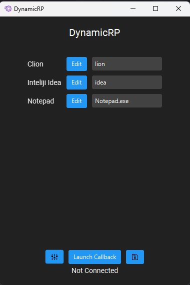

# DynamicRP

DynamicRP is a Discord Rich Presence Manager that allows you to display your current game in your Discord profile.

## Why DynamicRP?
Here is a quick Demo:

[](http://www.youtube.com/watch?v=omDVECqUStY)

http://www.youtube.com/watch?v=omDVECqUStY

Other Rich Presence Manager programs only allow you to set one Rich Presence at a time.
DynamicRP allows you to set multiple Rich Presence settings
and switch between them automatically based on the application you're running.
For example, if you set a Rich Presence for IntelliJ IDEA and one for CLion,
it will automatically switch which Rich Presence is displayed based on which application you're running.

- Save multiple Rich Presence configs
- Auto-launch on startup
- Various methods for setting Rich Presence:
    - Callback: Sends Rich Presence data every x seconds, according to your config
    - Auto Switch: Automatically switches between your configured Rich Presence settings based on the application you're running
- User-friendly JavaFX GUI
- No installation required: simply run the .jar file
- Automatic config saving
- System tray support
- Compatible with Windows, macOS, and Linux (tested on Windows 10 and 11, Ubuntu 20.04)
- A wide variety of themes

## Documentation
You can find a more detailed documentation [here](https://dynamicrp.gitbook.io/dynamicrp/)

## JVM Version
Any Java version that is above or equal to Java 8 should work. Tested on Java 8, 11, and 17. Recommended Java 17 only if you have issue with other Version.

## Support

| Operating System | Auto Launch On Start up            | Rich Presence | Auto Switch |
|------------------|------------------------------------|---------------|-------------|
| Windows          | Supported (tested on 10 and 11)    | Supported     | Supported   |
| macOS            | Supported (tested on MacOS/intel)  | Supported     | Supported   |
| Linux            | Supported (tested on Ubuntu 22.04) | Supported     | Supported   |

I wasn't able to test on other OS, but it should work on any OS that supports JavaFX and Discord.

## Branches

- Stable: Updated frequently when the development is stable
- Development: Updated frequently with new features or bug fixes
- Previous: Outdated release

## How to use


1. On your first start, you will be asked to select a directory for storing the program's data. This directory will be used to store the config JSON file.

> Unless you are using the default directory(recommended), the config directory will be stored in the environment variable "DynamicRP."


2. After selecting a directory, you will see the main screen. Enter your application ID in the Application ID field.

> Discord Developer Portal: https://discord.com/developers/applications. Create a new application and copy the application ID from there.

- Double-click an item on the list to open the edit screen, where you can edit the text to display in your Rich Presence. Start the callback by pressing the "Launch Callback" button.


- Delay: Time between callbacks in milliseconds (ignored if you only have one item in the list)
- Large Image/Small Image: Either an image key on Discord or a direct link to an image
- First Line/Second Line: Text displayed on the first and second lines of the Rich Presence

**Any empty or null field will be ignored**

Explore and enjoy!

## AutoSwitch


The textbook on the right is the name of the application to check for(case-sensitive). 
If you want to check for IJ, the ideal way is to put "idea" in the textbox instead of "IJ"
because the process name is "idea64.exe" or "idea.exe" depending on your system.
For CLion, ideally you should put "lion" in the textbox.


## Uninstalling

- Simply delete the .jar file to uninstall the program

> Note: This will not delete your config folder and environment variable(if you didn't use default directory). For complete uninstallation, manually delete the config folder.

- The config folder location is stored in the environment variable "DynamicRP"
## Learn

Interested in learning how it works? Check out the [LEARN.md](LEARN.md) file.

## How to build

This project is developed using Gradle on IntelliJ IDEA.
To build the project, simply clone it and open it in IntelliJ IDEA.
You can run the project with Gradle using:

```gradlew run```

To build the project, use:

```gradle build```

## TroubleShooting or Issues
Feel free to open an issue if you have any problem or suggestion, I will try to fix it as soon as possible.
Please also avoid direct modification of the config folder, as it may cause corruption of the config file.
Usually a restart of the program will fix the issue.

## License

This project is licensed under the MIT License - see the [LICENSE.md](LICENSE.md) file for details.

## Credits
This project wouldn't be possible without them.
you can find the full list of credits [here](src/main/resources/lee/aspect/dev/dynamicrp/licenses/index.html)

## Change log
You can find the full change log [here](CHANGELOG.md)
