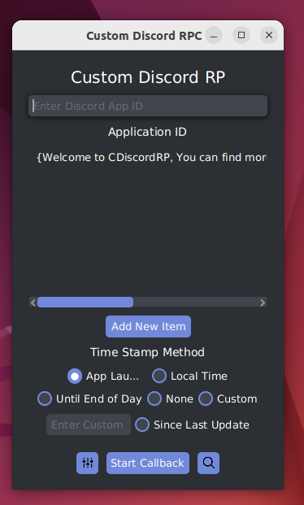

# CDiscordRP

CDiscordRP is a Discord Rich Presence Manager that allows you to display your current game in your Discord profile.

### Attention: All previously posted release and pre-release versions are outdated. In the meantime, please pull the latest stable branch as I continue to work on version 1.0.

## You are currently in the development branch. The application might be unstable.

## Features

- Save multiple Rich Presence configs
- Auto-launch on startup
- Various methods for setting Rich Presence:
    - Callback: Sends Rich Presence data every x seconds, according to your config
    - Auto Switch: Automatically switches between your configured Rich Presence settings based on the application you're running
- User-friendly JavaFX GUI
- No installation required: simply run the .jar file
- Automatic config saving
- System tray support
- Compatible with Windows, macOS, and Linux (tested on Windows 10 and 11, Ubuntu 20.04)
- A wide variety of themes

## Support

| Operating System | Auto Launch On Start up            | Rich Presence | Auto Switch     |
|------------------|------------------------------------|---------------|-----------------|
| Windows          | Supported (tested on 10 and 11)    | Supported     | Supported       |
| macOS            | Currently Fixing                   | Supported     | Might be bugged |
| Linux            | Supported (tested on Ubuntu 22.04) | Supported     | Supported       |

macOS's implementation should be similar to Linux, but it has not been tested yet.

## Branches

- Stable: Updated frequently when the development is stable
- Development: Updated frequently with new features or bug fixes
- Previous: Outdated release

## How to use


1. On your first start, you will be asked to select a directory for storing the program's data. This directory will be used to store the config JSON file.

> Unless you are using the default directory(recommended), the config directory will be stored in the environment variable "CDiscordRP."



2. After selecting a directory, you will see the main screen. Enter your application ID in the Application ID field.

> Discord Developer Portal: https://discord.com/developers/applications. Create a new application and copy the application ID from there.

- Double-click an item on the list to open the edit screen, where you can edit the text to display in your Rich Presence. Start the callback by pressing the "Launch Callback" button.


- Delay: Time between callbacks in milliseconds (ignored if you only have one item in the list)
- Large Image/Small Image: Either an image key on Discord or a direct link to an image
- First Line/Second Line: Text displayed on the first and second lines of the Rich Presence

**Any empty or null field will be ignored**

Explore and enjoy!

## Uninstalling

- Simply delete the .jar file to uninstall the program

> Note: This will not delete your config folder. For complete uninstallation, manually delete the config folder.

- The config folder location is stored in the environment variable "CDiscordRP"
> On Windows, delete the environment variable by running the following command in CMD:
> `set CDiscordRP=""`

## Learn

Interested in learning how it works? Check out the [LEARN.md](LEARN.md) file.

## How to build

This project is developed using Gradle on IntelliJ IDEA.
To build the project, simply clone it and open it in IntelliJ IDEA.
You can run the project with Gradle using:

```gradlew run```

To build the project, use:

```gradle build```

## License

This project is licensed under the MIT License - see the [LICENSE.md](LICENSE.md) file for details.